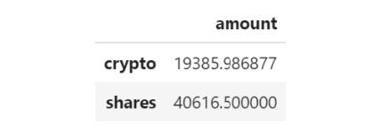

# Financial Planning:API

## Background

This project aims to assess personal finances, and also be able to forecast a reasonably good retirement plan based on cryptocurrencies, stocks, and bonds.

First financial tool which was created was the personal finance planner that will allow users to visualize their savings composed by investments in shares and cryptocurrencies to assess if they have enough money as an emergency fund.

The second tool was a retirement planning tool that will use the Alpaca API to fetch historical closing prices for a retirement portfolio composed of stocks and bonds, then run Monte Carlo simulations to project the portfolio performance at 30 years. I then use the Monte Carlo data to calculate the expected portfolio returns given a specific initial investment amount.

---

### Resources

This project utilizes two APIs:

* The **Alpaca Markets API** to pull historical stocks and bonds information.  
    
* The **Alternative Free Crypto API**to retrieve Bitcoin and Ethereum prices.

The documentation for these APIs can be found via the following links:

* [Free Crypto API Documentation](https://alternative.me/crypto/api/)

* [AlpacaDOCS](https://alpaca.markets/docs/)
---

### Part 1 - Personal Finance Planner

Assumptions to create a personal finance planner prototype:

* The average household income for each member of the credit union is $12,000.

* Every union member has a savings portfolio composed of cryptocurrencies, stocks and bonds:

    * Assume the following amount of crypto assets: `1.2` BTC and `5.3` ETH.

    * Assume the following amount of shares in stocks and bonds: `50` SPY (stocks) and `200` AGG (bonds).

#### Collected Crypto Prices Using the `requests` Library

1. Created two variables called `my_btc` and `my_eth`. Set them equal to `1.2` and `5.3`, respectively.

2. Used the `requests` library to fetch the current price in US dollars of bitcoin (`BTC`) and ethereum (`ETH`) using the **Alternative Free Crypto API** endpoints.

3. Parse the API JSON response to select only the crypto prices and store each price in a variable.

    **Hint:** Be aware of the particular identifier for each cryptocurrency in the API JSON response - the bitcoin identifier is `1` whereas ethereum is `1027`.

4. Computed the portfolio value of cryptocurrencies and print the results.

#### Collected Investments Data Using Alpaca: `SPY` (stocks) and `AGG` (bonds)

**Important:** Remember to create a `.env` file in your working directory to store the values of your Alpaca API key and Alpaca secret key.

1. Created two variables named `my_agg` and `my_spy` and set them equal to `200` and `50`, respectively.

2. Set the Alpaca API key and secret key variables, then created the Alpaca API object using the `tradeapi.REST` function from the Alpaca SDK.

3. Formated the current date as ISO format.

4. Get the current closing prices for `SPY` and `AGG` using Alpaca's `get_barset()` function. Transformed the function's response to a Pandas DataFrame and preview the data.

5. Picked the `SPY` and `AGG` close prices from the Alpaca's `get_barset()` DataFrame response and store them as Python variables. Printed the closing values for validation.

6. Computed the value in dollars of the current amount of shares and print the results.

#### Savings Health Analysis

Assessing the financial health of the credit union's members.

1. Created a variable called `monthly_income` and set its value to `12000`.

2. To analyze savings health, created a DataFrame called `df_savings` with two rows. Store the total value in dollars of the crypto assets in the first row and the total value of the shares in the second row.

    **Hint:** The `df_savings` DataFrame should have one column named `amount` and two rows where `crypto` and `shares` are the index values: 
    
    

3. Used the `df_savings` DataFrame to plot a pie chart to visualize the composition of personal savings.

4. Used `if` conditional statements to validate if the current savings are enough for an emergency fund. An ideal emergency fund should be equal to three times the monthly income.

    * If total savings are greater than the emergency fund, display a message congratulating the person for having enough money in this fund.

    * If total savings are equal to the emergency fund, display a message congratulating the person on reaching this financial goal.

    * If total savings are less than the emergency fund, display a message showing how many dollars away the person is from reaching the goal.

### Part 2 - Retirement Planning

This section uses the Alpaca API to fetch historical closing prices for a retirement portfolio and then use the MCForecastTools toolkit to create Monte Carlo simulations to project the portfolio performance at `30` years. 

#### Monte Carlo Simulation

1. Used the Alpaca API to fetch five years historical closing prices for a traditional `40/60` portfolio using the `SPY` and `AGG` tickers to represent the `60%` stocks (`SPY`) and `40%` bonds (`AGG`) composition of the portfolio. Make sure to convert the API output to a DataFrame and preview the output.

2. Configured and executed a Monte Carlo Simulation of `500` runs and `30` years for the `40/60` portfolio.

3. Ploted the simulation results and the probability distribution/confidence intervals.

    
        
    

#### Retirement Analysis

1. Fetched the summary statistics from the Monte Carlo simulation results.

1. Given an initial investment of `$20,000`, calculated the expected portfolio return in dollars at the `95%` lower and upper confidence intervals.

2. Calculated the expected portfolio return at the `95%` lower and upper confidence intervals based on a `50%` increase in the initial investment.

### Early Retirement

Tred adjusting the portfolio to either include more risk (a higher stock than bond ratio) or to have a larger initial investment and rerun the retirement analysis to see what it would take to retire in `5` or `10` years instead of `30`!
